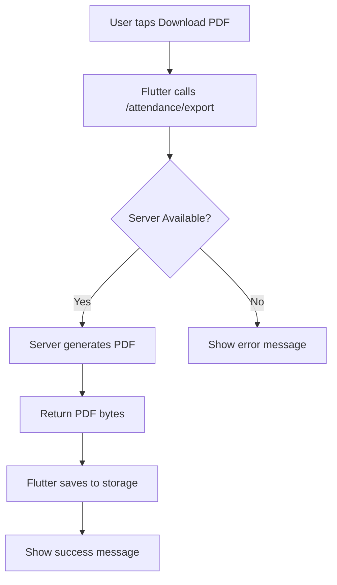

# Attendance PDF Export Feature Plan

## Overview
This document outlines the implementation plan for adding a PDF export feature to the Church Attendance app. The feature allows users to download attendance records as a PDF file.

## PDF Columns
| Column | Source | Description |
|--------|--------|-------------|
| Name | `contact.name` or `contact.phone` | Contact's display name |
| Location | `contact.tags` (location tags) | One of: kanana, majaneng, mashemong, soshanguve, kekana |
| Phone | `contact.phone` | Contact's phone number |
| Member | `contact.tags` contains 'member' | Yes/No |

---

## Part 1: Server-Side Implementation (`/attendance/export`)

### Endpoint Specification

```
GET /attendance/export
```

**Query Parameters:**
| Parameter | Type | Required | Description |
|-----------|------|----------|-------------|
| `date_from` | ISO8601 datetime | No | Start of date range |
| `date_to` | ISO8601 datetime | No | End of date range |
| `service_type` | string | No | Filter by service type (Sunday, Tuesday, etc.) |

**Response:**
- `Content-Type`: `application/pdf`
- `Content-Disposition`: `attachment; filename="attendance_export_YYYY-MM-DD.pdf"`

### Recommended Server Structure (Python/FastAPI)

```python
# app/routers/attendance.py

@router.get("/export")
async def export_attendance_pdf(
    date_from: Optional[datetime] = None,
    date_to: Optional[datetime] = None,
    service_type: Optional[str] = None,
    current_user = Depends(get_current_user)
):
    """
    Export attendance records as PDF.
    
    Columns: Name, Location, Phone, Member
    """
    # 1. Query attendance records with contact info
    attendances = await get_attendances_with_contacts(
        date_from=date_from,
        date_to=date_to,
        service_type=service_type
    )
    
    # 2. Extract contact data
    data = []
    for att in attendances:
        contact = att.contact
        location = extract_location_from_tags(contact.tags)  # Excludes 'member'
        is_member = 'member' in contact.tags
        
        data.append({
            'name': contact.name or contact.phone,
            'location': location or 'N/A',
            'phone': contact.phone,
            'member': 'Yes' if is_member else 'No'
        })
    
    # 3. Generate PDF
    pdf_bytes = generate_attendance_pdf(data)
    
    # 4. Return file
    return Response(
        content=pdf_bytes,
        media_type="application/pdf",
        headers={
            "Content-Disposition": f"attachment; filename=attendance_export_{date.today()}.pdf"
        }
    )
```

### PDF Generation Helper (Example)

```python
# app/services/pdf_service.py

from reportlab.lib import colors
from reportlab.lib.pagesizes import A4
from reportlab.lib.styles import getSampleStyleSheet
from reportlab.platypus import SimpleDocTemplate, Table, TableStyle

def generate_attendance_pdf(data: List[dict]) -> bytes:
    """Generate PDF with attendance data."""
    
    # Create PDF document
    buffer = io.BytesIO()
    doc = SimpleDocTemplate(buffer, pagesize=A4)
    elements = []
    
    # Add title
    styles = getSampleStyleSheet()
    elements.append(Paragraph("Attendance Export", styles['Title']))
    elements.append(Paragraph(f"Generated: {datetime.now()}", styles['Normal']))
    elements.append(Spacer(1, 12))
    
    # Create table data (with header)
    table_data = [['Name', 'Location', 'Phone', 'Member']]
    for row in data:
        table_data.append([
            row['name'],
            row['location'],
            row['phone'],
            row['member']
        ])
    
    # Create and style table
    table = Table(table_data)
    table.setStyle(TableStyle([
        ('BACKGROUND', (0, 0), (-1, 0), colors.grey),
        ('TEXTCOLOR', (0, 0), (-1, 0), colors.whitesmoke),
        ('ALIGN', (0, 0), (-1, -1), 'LEFT'),
        ('FONTNAME', (0, 0), (-1, 0), 'Helvetica-Bold'),
        ('FONTSIZE', (0, 0), (-1, 0), 12),
        ('BOTTOMPADDING', (0, 0), (-1, 0), 12),
        ('BACKGROUND', (0, 1), (-1, -1), colors.beige),
        ('GRID', (0, 0), (-1, -1), 1, colors.black),
    ]))
    
    elements.append(table)
    doc.build(elements)
    
    return buffer.getvalue()
```

---

## Part 2: Client-Side Implementation (Flutter)

### 2.1 Add Endpoint Constant

**File:** [`lib/core/network/api_constants.dart`](lib/core/network/api_constants.dart)

```dart
// Add after existing attendance endpoints (line ~36)
static const String attendanceExport = '/attendance/export';
```

### 2.2 Add PDF Download Method to DioClient

**File:** [`lib/core/network/dio_client.dart`](lib/core/network/dio_client.dart)

Add a new method to download the PDF:

```dart
/// GET /attendance/export
/// Downloads attendance PDF with optional filters.
Future<Response> downloadAttendancePdf({
  String? dateFrom,
  String? dateTo,
  String? serviceType,
}) async {
  final queryParams = <String, dynamic>{};
  if (dateFrom != null) queryParams['date_from'] = dateFrom;
  if (dateTo != null) queryParams['date_to'] = dateTo;
  if (serviceType != null) queryParams['service_type'] = serviceType;

  return get(
    ApiConstants.attendanceExport,
    queryParameters: queryParams,
    options: Options(
      responseType: ResponseType.bytes,
      contentType: 'application/pdf',
    ),
  );
}
```

### 2.3 Add Method to AttendanceRemoteDataSource

**File:** [`lib/features/attendance/data/datasources/attendance_remote_datasource.dart`](lib/features/attendance/data/datasources/attendance_remote_datasource.dart)

```dart
/// Downloads attendance PDF from server.
Future<Uint8List> downloadAttendancePdf({
  DateTime? dateFrom,
  DateTime? dateTo,
  ServiceType? serviceType,
}) async {
  try {
    final queryParams = <String, dynamic>{};
    
    if (dateFrom != null) {
      queryParams['date_from'] = dateFrom.toUtc().toIso8601String();
    }
    if (dateTo != null) {
      queryParams['date_to'] = dateTo.toUtc().toIso8601String();
    }
    if (serviceType != null) {
      queryParams['service_type'] = serviceType.backendValue;
    }

    final response = await _dioClient.dio.get(
      ApiConstants.attendanceExport,
      queryParameters: queryParams,
      options: Options(
        responseType: ResponseType.bytes,
      ),
    );

    return Uint8List.fromList(response.data);
  } on DioException catch (e) {
    if (e.type == DioExceptionType.connectionError ||
        e.type == DioExceptionType.unknown) {
      throw const AttendanceRemoteException(
        'Network error',
        isNetworkError: true,
      );
    }
    rethrow;
  }
}
```

### 2.4 Add Repository Method

**File:** [`lib/features/attendance/domain/repositories/attendance_repository.dart`](lib/features/attendance/domain/repositories/attendance_repository.dart)

```dart
/// Downloads attendance PDF from server.
Future<Uint8List> downloadAttendancePdf({
  DateTime? dateFrom,
  DateTime? dateTo,
  ServiceType? serviceType,
});
```

### 2.5 Add Download Button to AttendanceHistoryScreen

**File:** [`lib/features/attendance/presentation/screens/attendance_history_screen.dart`](lib/features/attendance/presentation/screens/attendance_history_screen.dart)

Add to the AppBar actions:

```dart
IconButton(
  icon: const Icon(Icons.download),
  onPressed: _downloadPdf,
  tooltip: 'Export to PDF',
),
```

Add the download method:

```dart
Future<void> _downloadPdf() async {
  setState(() => _isLoading = true);
  
  try {
    final remoteDataSource = ref.read(attendanceRemoteDataSourceProvider);
    final pdfBytes = await remoteDataSource.downloadAttendancePdf(
      dateFrom: _dateFrom,
      dateTo: _dateTo,
      serviceType: _selectedServiceType,
    );
    
    // Save to downloads folder
    final directory = await getExternalStorageDirectory();
    final file = File('${directory?.path}/attendance_export_${DateTime.now().millisecondsSinceEpoch}.pdf');
    await file.writeAsBytes(pdfBytes);
    
    if (mounted) {
      ScaffoldMessenger.of(context).showSnackBar(
        SnackBar(content: Text('PDF saved to: ${file.path}')),
      );
    }
  } catch (e) {
    if (mounted) {
      ScaffoldMessenger.of(context).showSnackBar(
        SnackBar(
          content: Text('Error downloading PDF: $e'),
          backgroundColor: Colors.red,
        ),
      );
    }
  } finally {
    setState(() => _isLoading = false);
  }
}
```

---

## Implementation Workflow



---

## Summary of Files to Modify

| File | Change |
|------|--------|
| `lib/core/network/api_constants.dart` | Add `attendanceExport` constant |
| `lib/core/network/dio_client.dart` | Add `downloadAttendancePdf()` method |
| `lib/features/attendance/data/datasources/attendance_remote_datasource.dart` | Add PDF download method |
| `lib/features/attendance/domain/repositories/attendance_repository.dart` | Add repository interface |
| `lib/features/attendance/data/repositories/attendance_repository_impl.dart` | Implement repository method |
| `lib/features/attendance/presentation/screens/attendance_history_screen.dart` | Add download button and handler |

---

## Notes

1. **Server Dependency**: This plan assumes you have access to the backend server code. The PDF generation should be done server-side as you specified.

2. **PDF Library**: On the server, you can use any Python PDF library:
   - `reportlab` (recommended, most feature-rich)
   - `fpdf` (simpler, lighter)
   - `weasyprint` (HTML to PDF)

3. **Date Filtering**: The PDF export should respect the same date range and service type filters as the existing attendance list.

4. **File Storage**: On Android, you may want to use the Downloads folder or share the PDF directly using a file picker.
