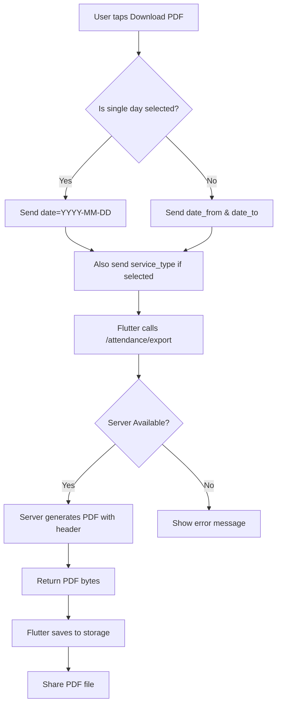

# Attendance PDF Export Feature Plan - Updated

## Overview
This document outlines the implementation plan for adding a PDF export feature to the Church Attendance app. The feature allows users to download attendance records as a PDF file.

## PDF Requirements

### PDF Columns
| Column | Source | Description |
|--------|--------|-------------|
| Name | `contact.name` or `contact.phone` | Contact's display name |
| Location | `contact.tags` (location tags) | One of: kanana, majaneng, mashemong, soshanguve, kekana |
| Phone | `contact.phone` | Contact's phone number |
| Member | `contact.tags` contains 'member' | Yes/No |

### PDF Header Format
The PDF header should display the date range and service type filter:
- **Single Date (no range)**: Shows specific date + service type
  - Example: `Date: 21 February 2026` | `Service Type: Sunday Service`
- **Date Range**: Shows date range + service type filter
  - Example: `Date: 21 February 2026 - 26 March 2026` | `Service Type: Sunday Services only`

---

## Part 1: Server-Side Implementation (You Will Handle)

### Endpoint Specification

```
GET /attendance/export
```

**Query Parameters:**
| Parameter | Type | Required | Description |
|-----------|------|----------|-------------|
| `date` | string | No | Single date in YYYY-MM-DD format (for single day export) |
| `date_from` | ISO8601 datetime | No | Start of date range (when not using single date) |
| `date_to` | ISO8601 datetime | No | End of date range (when not using single date) |
| `service_type` | string | No | Filter by service type (Sunday, Tuesday, Special Event) |

**Response:**
- `Content-Type`: `application/pdf`
- `Content-Disposition`: `attachment; filename="attendance_export_YYYY-MM-DD.pdf"`

### Server Implementation Notes

1. **Date Handling**:
   - If `date` parameter is provided → Use it as single date (filter attendance for that specific day)
   - If `date_from` and `date_to` are provided → Use as date range

2. **Service Type in PDF Header**:
   - If `service_type` is provided → Show "Service Type: {Service Type} only" in header
   - If no service_type → Show "Service Type: All Services"

3. **Example PDF Header Output**:
   ```
   Attendance Export
   Date: 21 February 2026 | Service Type: Sunday Service
   
   OR
   
   Attendance Export  
   Date: 21 February 2026 - 26 March 2026 | Service Type: Sunday Services only
   ```

### Recommended Server Structure (Python/FastAPI)

```python
# app/routers/attendance.py

@router.get("/export")
async def export_attendance_pdf(
    date: Optional[str] = None,  # Single date: YYYY-MM-DD
    date_from: Optional[datetime] = None,
    date_to: Optional[datetime] = None,
    service_type: Optional[str] = None,
    current_user = Depends(get_current_user)
):
    """
    Export attendance records as PDF.
    
    Query params:
    - date: Single date in YYYY-MM-DD format
    - date_from: Start date for range
    - date_to: End date for range  
    - service_type: Filter by service type
    
    PDF Header shows:
    - Date: single date OR "from - to" range
    - Service Type: specific type or "All Services"
    """
    
    # 1. Determine date filter
    if date:
        # Single date - parse YYYY-MM-DD
        target_date = datetime.strptime(date, '%Y-%m-%d').date()
        date_from = datetime.combine(target_date, datetime.min.time())
        date_to = datetime.combine(target_date, datetime.max.time())
    
    # 2. Query attendance records with contact info
    attendances = await get_attendances_with_contacts(
        date_from=date_from,
        date_to=date_to,
        service_type=service_type
    )
    
    # 3. Format date string for PDF header
    if date:
        # Single date: "21 February 2026"
        date_str = target_date.strftime('%d %B %Y')
    else:
        # Range: "21 February 2026 - 26 March 2026"
        date_str = f"{date_from.strftime('%d %B %Y')} - {date_to.strftime('%d %B %Y')}"
    
    # 4. Format service type for PDF header
    if service_type:
        service_type_str = f"{service_type} Services only"
    else:
        service_type_str = "All Services"
    
    # 5. Extract contact data
    data = []
    for att in attendances:
        contact = att.contact
        location = extract_location_from_tags(contact.tags)  # Excludes 'member'
        is_member = 'member' in contact.tags
        
        data.append({
            'name': contact.name or contact.phone,
            'location': location or 'N/A',
            'phone': contact.phone,
            'member': 'Yes' if is_member else 'No'
        })
    
    # 6. Generate PDF with custom header
    pdf_bytes = generate_attendance_pdf(
        data,
        date_str=date_str,
        service_type_str=service_type_str
    )
    
    # 7. Return file
    return Response(
        content=pdf_bytes,
        media_type="application/pdf",
        headers={
            "Content-Disposition": f"attachment; filename=attendance_export_{date.today()}.pdf"
        }
    )
```

### PDF Generation Helper with Custom Header

```python
# app/services/pdf_service.py

from reportlab.lib import colors
from reportlab.lib.pagesizes import A4
from reportlab.lib.styles import getSampleStyleSheet
from reportlab.platypus import SimpleDocTemplate, Table, TableStyle, Paragraph, Spacer

def generate_attendance_pdf(data: List[dict], date_str: str, service_type_str: str) -> bytes:
    """Generate PDF with attendance data and custom header."""
    
    # Create PDF document
    buffer = io.BytesIO()
    doc = SimpleDocTemplate(buffer, pagesize=A4)
    elements = []
    
    styles = getSampleStyleSheet()
    
    # Add title
    elements.append(Paragraph("Attendance Export", styles['Title']))
    
    # Add date and service type in header line
    header_text = f"Date: {date_str} | Service Type: {service_type_str}"
    elements.append(Paragraph(header_text, styles['Normal']))
    elements.append(Paragraph(f"Generated: {datetime.now().strftime('%d/%m/%Y %H:%M')}", styles['Normal']))
    elements.append(Spacer(1, 12))
    
    # Create table data (with header)
    table_data = [['Name', 'Location', 'Phone', 'Member']]
    for row in data:
        table_data.append([
            row['name'],
            row['location'],
            row['phone'],
            row['member']
        ])
    
    # Create and style table
    table = Table(table_data)
    table.setStyle(TableStyle([
        ('BACKGROUND', (0, 0), (-1, 0), colors.grey),
        ('TEXTCOLOR', (0, 0), (-1, 0), colors.whitesmoke),
        ('ALIGN', (0, 0), (-1, -1), 'LEFT'),
        ('FONTNAME', (0, 0), (-1, 0), 'Helvetica-Bold'),
        ('FONTSIZE', (0, 0), (-1, 0), 12),
        ('BOTTOMPADDING', (0, 0), (-1, 0), 12),
        ('BACKGROUND', (0, 1), (-1, -1), colors.beige),
        ('GRID', (0, 0), (-1, -1), 1, colors.black),
    ]))
    
    elements.append(table)
    doc.build(elements)
    
    return buffer.getvalue()
```

---

## Part 2: Mobile Client Implementation (Already Complete ✓)

The Flutter mobile client has already been implemented with the following components:

### 2.1 API Constants
**File:** [`lib/core/network/api_constants.dart`](lib/core/network/api_constants.dart:37)
- Already has: `attendanceExport = '/attendance/export'`

### 2.2 Remote DataSource
**File:** [`lib/features/attendance/data/datasources/attendance_remote_datasource.dart`](lib/features/attendance/data/datasources/attendance_remote_datasource.dart:240)
- Already has `downloadAttendancePdf()` method that sends:
  - `date` parameter for single date (YYYY-MM-DD format)
  - `date_from` and `date_to` for date range
  - `service_type` for filtering

### 2.3 Repository Interface & Implementation
**Files:** 
- [`lib/features/attendance/domain/repositories/attendance_repository.dart`](lib/features/attendance/domain/repositories/attendance_repository.dart:131)
- [`lib/features/attendance/data/repositories/attendance_repository_impl.dart`](lib/features/attendance/data/repositories/attendance_repository_impl.dart:383)

- Already has `downloadAttendancePdf()` method in interface and implementation

### 2.4 Provider (History Screen)
**File:** [`lib/features/attendance/presentation/providers/attendance_history_provider.dart`](lib/features/attendance/presentation/providers/attendance_history_provider.dart:128)

- Already has `downloadPdf()` method that:
  - Detects single day vs range using `_isSameDay()`
  - Sends `date` parameter for single day
  - Sends `date_from`/`date_to` for range
  - Sends `service_type` filter
  - Saves and shares the PDF

### 2.5 UI - Download Button
**File:** [`lib/features/attendance/presentation/screens/attendance_history_screen.dart`](lib/features/attendance/presentation/screens/attendance_history_screen.dart:136)

- Already has download button in AppBar with:
  - Loading indicator while downloading
  - Calls `ref.read(attendanceHistoryProvider.notifier).downloadPdf()`

---

## Implementation Workflow



---

## Summary

### Mobile Client (Complete ✓)
All Flutter code is already implemented. The client:
1. Sends `date` parameter for single day exports
2. Sends `date_from` and `date_to` for range exports  
3. Sends `service_type` filter when selected
4. Handles the PDF download, save, and share

### Server (Your Task)
The server needs to:
1. Accept the `date` parameter (YYYY-MM-DD format) for single date
2. Accept `date_from` and `date_to` for date range
3. Accept `service_type` for filtering
4. Generate PDF with header showing:
   - Date: single date OR "from - to" range
   - Service Type: specific type + "only" OR "All Services"

### Files to Modify (Server)
| File | Change |
|------|--------|
| `app/routers/attendance.py` | Add `/export` endpoint with new params |
| `app/services/pdf_service.py` | Update PDF header with date + service type |

---

## Notes

1. **Server Dependency**: You will implement the backend server code for PDF generation.

2. **PDF Library**: On the server, you can use any Python PDF library:
   - `reportlab` (recommended, most feature-rich)
   - `fpdf` (simpler, lighter)
   - `weasyprint` (HTML to PDF)

3. **Date Filtering**: The PDF export should respect the same date range and service type filters as the existing attendance list.

4. **File Storage**: On Android, the client saves to documents directory and uses share functionality.
